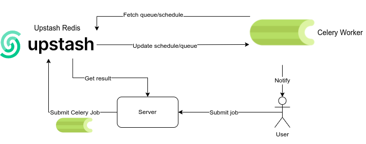

 

  <h3 align="center">Job Processor</h3>

  

    Flask & Celery job processing with Upstash Redis for background tasks and result storage.

  

# [Celery](https://github.com/celery/celery) Job Processor

## A simple job processing scenario, showcasing a Flask and Celery by using Upstash Redis.
You have a server, where you process customer's jobs for them: apply some training for their models, apply image, text processing etc.
You can reduce the server load and keep the responsiveness by using Celery: Allowing you to run processes in the background.

Once a request is made to `/run` endpoint with necessary parameters (`id`, `email`, `difficulty`), the server generates a background job using Celery and responds with an `enqued` message to the requester.
Depending on the workload, Celery completes the job in an unknown amount of time. After the processing is finished, Celery sends a message to the server via `/notify` endpoint. In there, customers can be notified that their processing is complete, or even sent some reports regarding that (which is also a usecase for Celery).

### Since Upstash Redis can also be used as a durable storage, we can and have configured Celery to use Upstash Redis as a backend database. Meaning, all the results of the tasks from Celery are kept in storage for later retrieval.
Once a request is made to `/result` with `id` parameter, corresponding result is returned from the backend database.

### Install Dependencies
`pip install -r requirements.txt` 
### Run Flask Server
`flask --app server run`
### Start Celery Worker
`celery -A tasks worker --loglevel=INFO`

### Run a Job
` curl -X POST http://localhost:5000/run -H 'Content-Type: application/json' -d '{"id":"<id>", "email":"a@b.com", "difficulty":"hard"}' `

### Get Results of a Job
Once a notification is sent to `/notify`, get the result:

` curl -X POST http://localhost:5000/result -H 'Content-Type: application/json' -d '{"id":"<id>"}' `

### Learn More

To learn more about Upstash and its services, check out the following resources:

- [Documentation](https://docs.upstash.com)
- [Website](https://upstash.com)
- [Blog](https://upstash.com/blog)
- [Console](https://console.upstash.com)
- [Discord](https://upstash.com/discord)